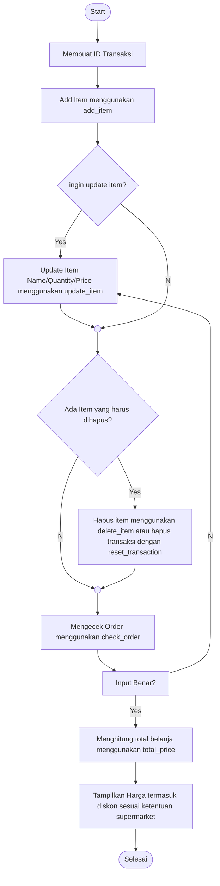

# Python Self service cashier

**Latar Belakang**

Sebagai programmer yang dimintai bantuan oleh Andi. Ia membutuhkan program untuk membuat sistem self-service di supermarketnya.
Dengan sistem ini customer bisa langsung memasukkan item yang dibeli, menghitung jumlah item yang dibeli, & harga item yang dibeli.

**Feature Requirement / Objectives**
1. Customer membuat ID Transaksi
2. Customer memasukkan nama item,jumlah item, dan harga barang.
  menggunakan method add_item(name,quantity,price)
3. Jika ada kesalahan dalam nama item, quantity ataupun harga, customer bisa melakukan:
  a. update_item_name untuk mengubah nama
  b. update_item_qty untuk mengubah quantity
  c. update_item_price untuk mengubah price
4. Jika batal membeli belanjaan, pelanggan bisa:
  a. method delete_item untuk menghapus salah satu item
  b. method reset_transaction untuk mengulang transaksi dari awal
5. Customer bisa memvalidasi barang belanjaan dengan cara check_order
6. customer bisa menghitung total harga belanjaan dengan method total_price. Harga total termasuk diskon yang ditentukan oleh supermarket.

**flowchart**

